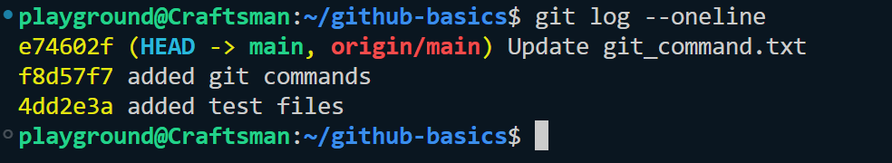
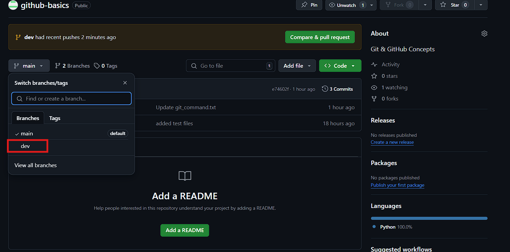

# Branching Strategies
## What is Branching Strategies? What is the Best Practice?
**Branching Strategies** are workflows that define how branches are used in Git to manage code changes. They ensure organized collaboration and a clean codebase.

## Common Branching Strategies
### Git Flow:
* Includes branches like `main` (for production), `develop` (for development), `feature`, `release`, and `hotfix`.

* Useful for large projects with formal release cycles.

### Feature Branching:
* Each feature/task is developed in its own branch and merged into `main` or `dev` once completed.

### Trunk-Based Development:
* Developers commit directly to `main` (or short-lived branches that are merged quickly).

* Ideal for fast, small teams or CI/CD practices.

### Release Branching:
* Specific branches for releasing versions while the development continues on other branches.

## Best Practices:
* **Use Descriptive Branch Names**: e.g., `feature/login-page`, `bugfix/header-alignment`.

* **Avoid Long-Lived Branches**: Merge branches quickly to reduce conflicts.
* **Perform Code Reviews**: Use pull requests to review changes before merging.
* **Keep the main Branch Stable**: Only merge tested, production-ready code.
* **Delete Merged Branches**: Clean up after merging to avoid clutter.


## Practice

* To print the current branch
```bash
git branch
```
* To create a branch
```bash
git branch dev
```
* To navigate to other branch
```bash
git switch dev
```
Output:


* Create a new file in the **dev branch**


Add and commit the newly created file in the dev branch:

```bash
git add file_for_dev_branch.txt 
```
```bash
git commit -m "added dev file"
```

Output:


> And now if you switch to main branch, you wont find any dev file, because branches are isolated from each other, and every branch maintains its own copy


### Git Logs "HEAD"
* Head represents the latest commits of git repositories:
```bash
git log
```
Or for one line output:
```bash
git log --oneline
```
Output:



### Merging branches

* First, Push the dev branch to GitHub

```bash
git push origin dev
```
Output:


* You may view the dev branch in the github repository



* Next, to merge the dev brach with main branch click on **Pull Request --> New Pull request**


* Select the dev branch in the compare section


* Click on **Create pull request**


* Click on **Merge pull request**


* And you may view the new dev file in the main branch


### Bring the merged changes to the local machine
* Switch to main branch

```bash
git switch main
```
* And then pull the changes made in GitHub to you local machine

```bash
git pull origin main
```
Output:


### Fetch & Pull
* To bring all the newly created branches from GitHub to local
```bash
git fetch
```
* To bring all the newly changes made in the GitHub repository to local
```bash
git pull
```
Output:


