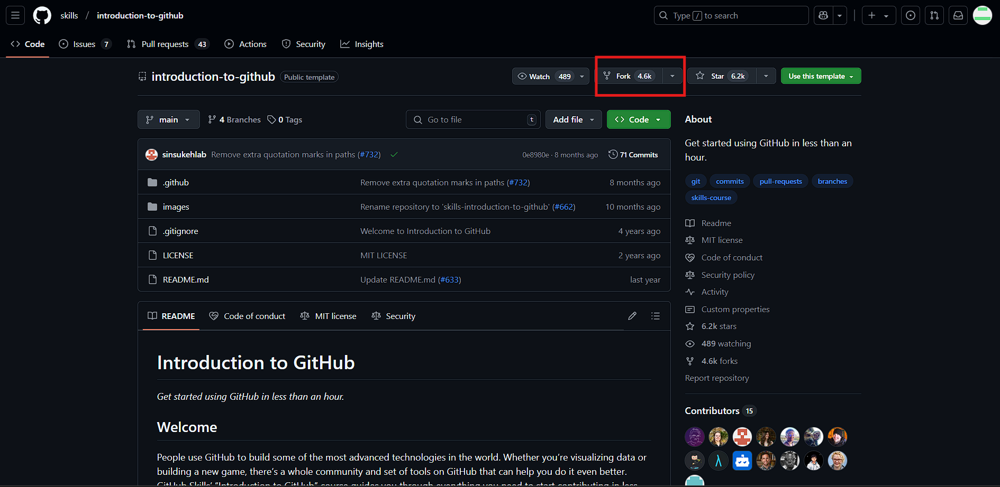
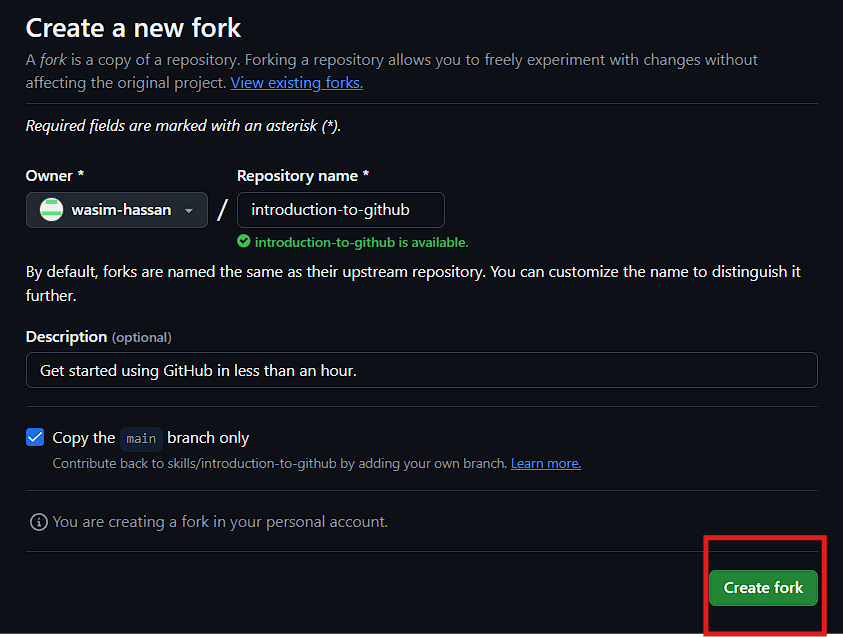
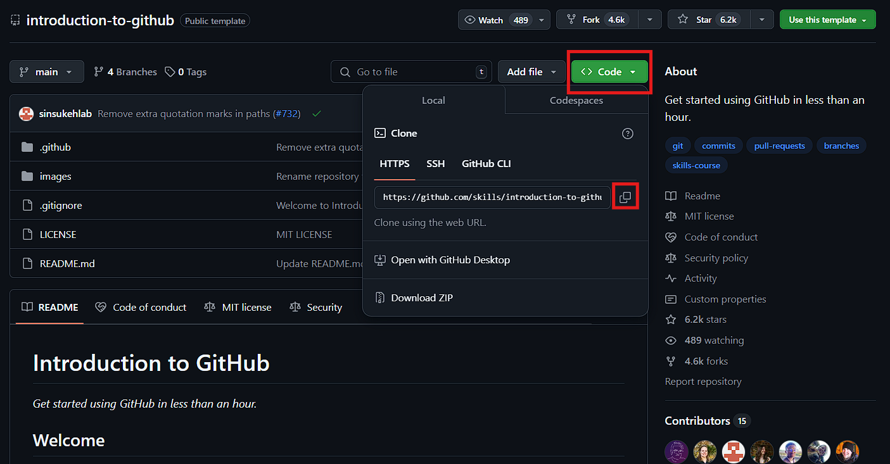
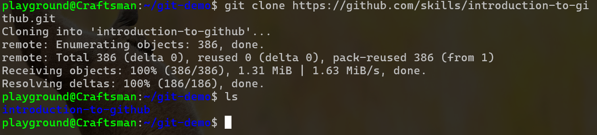

## Forking vs. Cloning a Repository: What's the Difference?

| Aspect | Forking | Cloning |
| --- | --- | ---|
| **Definition** | Creates a copy of someone else’s repository in your GitHub account. | Copies a repository from GitHub to your local machine. |
| **Purpose** | Independent development without affecting the original repository. | Local development and synchronization with the original repo. |
| **Where** | Happens on GitHub (remote). | Happens locally (on your system). |
| **Link to Original** | Remains linked to the original repository for pull requests. | Can optionally remain linked for fetching/pulling changes. |
| **Usage** | Used for contributing to open-source projects. | Used for working on your own or team projects. |

## How to Fork a repository?
* Open a GitHub repository, which my look like this one and then click on **fork**:


* And then Click on **Create Fork**


And the repository will be successfully forked to your GitHub.

## How to Clone a Repository?
* To clone a repository copy the url of that repository:


* Create a directory in yor local machine where you want to store the cloned the repository:


* Enter the following command to clone the repository

```bash
git clone <enter-the-url>
```
Output:


And the repository will be successfully Cloned to your GitHub.


