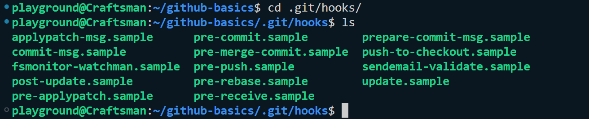
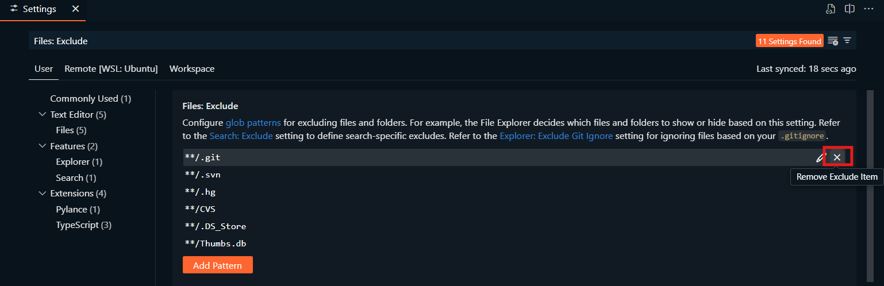
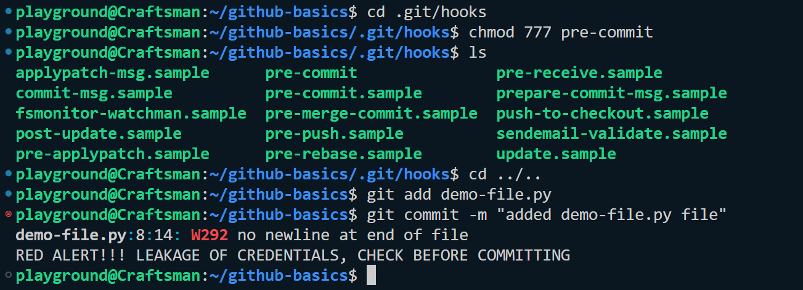

# GIT HOOKS
**Git Hooks** are custom scripts triggered automatically by specific events in the Git workflow. They allow automation of tasks like code checks, formatting, or deployment.

## Common Types of Git Hooks:
1. **Client-Side Hooks**: Run on the local machine.
* **Pre-Commit Hook**: Runs before a commit. Used for linting, code formatting, or running tests.

* **Commit-Msg Hook**: Validates commit messages (e.g., enforcing conventional commit formats).
* **Post-Commit Hook**: Runs after a commit, often for logging or notifications.

2. **Server-Side Hooks**: Run on the remote repository.
* **Pre-Receive Hook**: Validates pushes to the server

* **Post-Receive Hook**: Used for triggering CI/CD pipelines or deployment scripts.

## Why Use Git Hooks?
* Enforce team standards (e.g., code quality, commit message rules).

* Automate repetitive tasks (e.g., test execution before committing).


## Practice
* Locate and review the hook directory
```bash
cd .git/hooks/
ls
```
Output:


* To create & edit the **pre-commit** file using VS Code, make the .git folder visible in vs code.
* Open the `VS Code settings` and search for `Files: Exclude` and exclude the `.git` folder



* Add a file in `.git/hooks/` directory named `pre-commit` and add the following hook code in it for code check and correction:

```sh
files=$(git diff --cached --name-only --diff-filter=ACM | grep '\.py$')

flake8 $files

# To restrict leakage of password, secret key and API keys to the GitHub
if git grep -q "password\|secret_key\|API_KEY" $(git diff --cached --name-only); then
  echo "RED ALERT!!! LEAKAGE OF CREDENTIALS, CHECK BEFORE COMMITTING"
  exit 1
fi
```

* Make the `pre-commit` executable using:

```bash
chmod 777 pre-commit
```

* Install flake8 for code correction before running it:
```py
pip install flake8
```

* Create a file named `demo-file.py` with some incorrect and random code init:
```py
def my_function():

    password = "test@123"
    a = 5
    return a + password


my_function()

```

* Add and commit the `demo-file.py` file
```bash
git add demo-file.py
git commit -m "added demo-file.py file"
```
* You will get the following credential leakage error while committing the python file.
Output:


> 💡 **Tips:** Remove the password from the `demo-file.py` and you are good to go.


