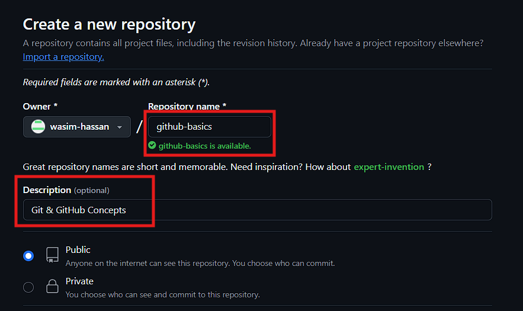
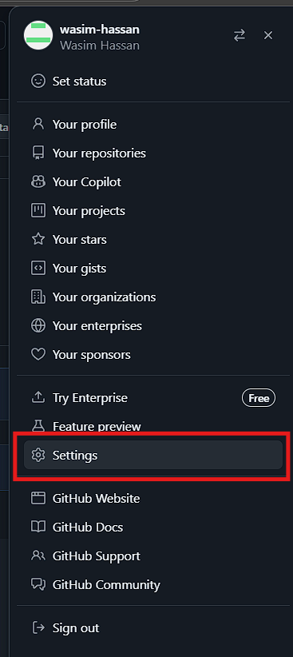

# Git & GitHub Basics

## Contains
1. Git & GitHub Concepts
2. Basic Commands of Git
3. Pull Request & Merging, Branching Strategies
4. Hooks (Pre-commit Hooks)
5. GitLab vs BitBucket. What's the difference?
6. [PROJECT](https://github.com/wasim-hassan/Appetizzer-Website) Deploying a website using GitHub Action and AWS S3 Bucket


## Git & GitHub setup
1. Download Git from the [office site](https://git-scm.com/downloads)
2. Verify Git is installed properly in your system by checking the version:

```bash
git --version
```
Output:


3. Sign up or login to your [GitHub](https://github.com/) account

### Creating File & Folder Using


> 💡 **Note:** VS Code Editor must be installed in the system

1. Create a folder named `github-for-practice` and open the folder with VS Code Editor
2. Create a python file in that folder e.g., `testing.py`


3. Make the Folder Version Control System:

```bash
git init
```
Output:


4. Verify the Git VSC directory is properly created:

```bash
ls -a
```
Output:


5. View the untracked files, which my show in red highlight:

```bash
git status
```
Output:


> 💡 **Note:** The target is to move the `testing.py` from untracked to tracked status

6. Add the python file to **staging** and make it trackable:

```bash
git add testing.py
```
Output:


7. If you want to revers the changes and make it **unstaged** the:

```bash
git rm --cached testing.py
```

8. Add the python file to **Git VCS**

```bash
git commit -m "added test file"
```

Output:


9. Adding another .txt file with git commands:


10. Committing the .txt file:


### Pushing the files and changes to GitHub


1. Create a repository in the GitHub
 

 




After creating the repository you may find a screen like this one:


2. Create a token access key:

* Click on th profile icon.


* Click on Settings


* Scroll Down and Select Developer settings


* Create a Personal Access Token


* Give a name, expiry date and scope of the Personal Access Token


* Generate the token key


* Copy the key and secure it with a notepad
 


3. Pushing the code the GitHub repository

```bash
git remote set-url origin https://github.com/your-github-username/your-github-repository-name.git

git branch -M main

git remote set-url origin https://Your-Access-Token-Key@github.com/your-github-username/your-github-repository-name.git

git push -u origin main
```
Output:


Refresh the GitHub repository and it may look like this one:


### Pulling Changes from GitHub to local
If you you made a changes using the GitHub GUI, as shown in the image.


* You can pull the changes to your local machine in the following way
 

* Enter the pull command in the terminal, and it will pull the changes to the local machine:

```bash
git pull origin main
```
Output:


